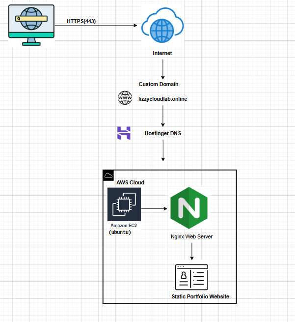

# Secure Linux Server Hardening and Static Website Deployment on AWS EC2

This project demonstrates how to deploy and secure a production-ready Linux web server on AWS EC2.

It covers infrastructure provisioning, Linux server hardening, firewall configuration, intrusion protection, domain mapping, and HTTPS encryption using Let's Encrypt.

The goal of this project is to showcase practical skills in Linux administration, cloud infrastructure deployment, and server security practices used by DevOps and Cloud Engineers.

---

## Live Demo

Website:  
https://lizzycloudlab.online

---

## Project Overview

In this project, a Linux web server was provisioned and secured from scratch on AWS EC2. A personal portfolio website was deployed and made accessible through a custom domain with HTTPS encryption.

Security best practices implemented include:

- Non-root administration
- SSH hardening
- Firewall configuration
- Intrusion protection
- HTTPS encryption with Let's Encrypt

This project reflects real-world tasks commonly performed by DevOps Engineers, Cloud Engineers, and Linux System Administrators.

## Architecture Diagram

This diagram illustrates how the static portfolio website is served through **Nginx on an AWS EC2 instance**, using a **custom domain configured via Hostinger DNS**. It shows the flow of traffic from the user’s browser through the internet to the EC2 server where the website is hosted.




---

## Technologies Used

### Cloud Platform
- AWS EC2

### Operating System
- Ubuntu Linux

### Web Server
- Nginx

### Security
- SSH Key Authentication
- UFW Firewall
- Fail2Ban Intrusion Prevention
- Let's Encrypt SSL

### Networking
- Domain DNS mapping (Hostinger)

### Tools
- Linux CLI
- Nano
- Certbot
---
## Implementation Steps

### Provisioning AWS Infrastructure

An EC2 instance running Ubuntu Linux was provisioned on AWS to host the web server.

- Launched an EC2 instance running Ubuntu Linux  
- Configured security group rules  
- Connected securely using SSH key authentication  

Example SSH connection:

```bash
ssh -i server_key.pem devopsadmin@SERVER_IP -p 2222
```

### Linux Server Hardening

Security best practices were applied to reduce the server attack surface and improve access control.

Admin user creation:

```bash
sudo adduser devopsadmin
sudo usermod -aG sudo devopsadmin
```

SSH hardening included:

- Disabling root login  
- Disabling password authentication  
- Enforcing SSH key authentication  
- Changing the default SSH port  

SSH configuration file:

```
/etc/ssh/sshd_config
```

Example configuration:

```
PermitRootLogin no
PasswordAuthentication no
Port 2222
```

### Firewall Configuration (UFW)

The Uncomplicated Firewall (UFW) was configured to allow only necessary network traffic.

```bash
sudo ufw allow 2222/tcp
sudo ufw allow 80
sudo ufw allow 443
```

Enable firewall:

```bash
sudo ufw enable
```

Verify firewall status:

```bash
sudo ufw status
```

### Intrusion Prevention with Fail2Ban

Fail2Ban was installed to automatically block IP addresses attempting repeated failed SSH logins.

Installation:

```bash
sudo apt install fail2ban
```

Check service status:

```bash
sudo fail2ban-client status sshd
```

### Nginx Web Server Setup

Nginx was installed and configured as the web server hosting the static website.

Installation:

```bash
sudo apt install nginx
```

Verify service status:

```bash
sudo systemctl status nginx
```

### Static Website Deployment

The website files were deployed to the default Nginx web root directory.

```
/var/www/html
```

Nginx server configuration file:

```
/etc/nginx/sites-available/devops-project
```

Example configuration:

```
server {
    listen 80;
    server_name lizzycloudlab.online www.lizzycloudlab.online;

    root /var/www/html;
    index index.html;

    location / {
        try_files $uri $uri/ =404;
    }
}
```

### Domain and DNS Configuration

A custom domain purchased from Hostinger was mapped to the AWS EC2 public IP.

DNS records used:

| Type | Name | Value |
|------|------|------|
| A | @ | EC2 Public IP |
| CNAME | www | lizzycloudlab.online |

### HTTPS Configuration with Let's Encrypt

HTTPS encryption was implemented using Let's Encrypt and Certbot.

Installation:

```bash
sudo apt install certbot python3-certbot-nginx
```

Generate SSL certificate:

```bash
sudo certbot --nginx
```

Test certificate renewal:

```bash
sudo certbot renew --dry-run
```

## Security Measures Implemented

- Non-root administrative access
- SSH key authentication
- Disabled password login
- Custom SSH port
- Firewall protection using UFW
- Intrusion detection using Fail2Ban
- HTTPS encryption with Let's Encrypt

These configurations significantly improve server security and align with modern cloud security practices.

---
## Lessons Learned

- Importance of securing Linux servers before exposing them to the internet.
- Practical experience with SSH hardening and key-based authentication.
- Understanding how firewall rules can affect server accessibility.
- Hands-on experience configuring HTTPS using Let's Encrypt and Certbot.
- Learning how DNS resolution connects a domain name to cloud infrastructure.
  
## Troubleshooting Issues

During deployment several issues were encountered and resolved:

- SSH connection issues caused by incorrect key permissions.
- Temporary lockout after changing the SSH port before updating firewall rules.
- DNS propagation delay after mapping the domain to the EC2 public IP.
- Initial HTTPS configuration issues before correctly running Certbot with Nginx.
  
## Project Screenshots

Screenshots demonstrating the deployment process, server configuration, and security setup are available in the `screenshots` directory of this repository.
---

## Skills Demonstrated

- Linux server administration
- AWS cloud infrastructure deployment
- Web server configuration
- Network security
- DNS and domain configuration
- HTTPS encryption
- Infrastructure troubleshooting

---

## Author

**Ikechukwu Elizabeth Nkwo**  
DevOps and Cloud Engineer focused on AWS, Linux systems, and infrastructure security. Currently seeking opportunities as a Junior DevOps Engineer, Cloud Engineer, or Linux System Administrator where I can contribute to building secure and reliable cloud infrastructure.

LinkedIn: https://linkedin.com/in/uroko-elizabeth-
GitHub: https://github.com/elizabeth-ikechukwu
